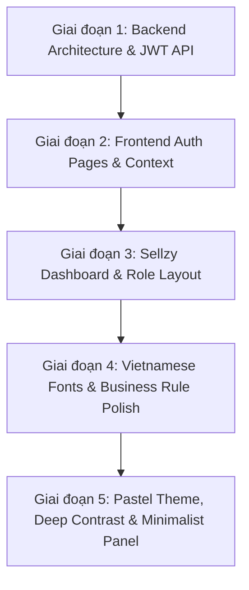

# BeautyPals - Changelog Quá Trình Xây Dựng Chức Năng Xác Thực & Đăng Nhập (Fullstack Auth)

> **Nhánh (Branch):** `log-in`  
> **Dự án:** BeautyPals - Nền tảng Quản trị Chuỗi Mỹ phẩm & Thương mại (IS207 - Web App)  
> **Kiến trúc:** Node.js (Express) + MySQL (DB) + React (Vite + Tailwind CSS) + JWT Authentication  

---

## Mục Lục
1. [Tổng quan mục tiêu](#1-tổng-quan-mục-tiêu)
2. [Timeline & Các giai đoạn phát triển](#2-timeline--các-giai-đoạn-phát-triển)
   - [Giai đoạn 1: Thiết lập Kiến trúc & Luồng Backend Auth](#giai-đoạn-1-thiết-lập-kiến-trúc--luồng-backend-auth)
   - [Giai đoạn 2: Xây dựng Giao diện Frontend & Quản lý State toàn cục](#giai-đoạn-2-xây-dựng-giao-diện-frontend--quản-lý-state-toàn-cục)
   - [Giai đoạn 3: Bố cục Dashboard & Định hình Design System Sellzy](#giai-đoạn-3-bố-cục-dashboard--định-hình-design-system-sellzy)
   - [Giai đoạn 4: Tinh gọn Nghiệp vụ & Chuẩn hóa Typography tiếng Việt](#giai-đoạn-4-tinh-gọn-nghiệp-vụ--chuẩn-hóa-typography-tiếng-việt)
   - [Giai đoạn 5: Tái cấu trúc Bảng màu Pastel, Tăng Tương phản & Tối giản Panel](#giai-đoạn-5-tái-cấu-trúc-bảng-màu-pastel-tăng-tương-phản--tối-giản-panel)
3. [Chi tiết Kiến trúc Hệ thống & Files Mã nguồn](#3-chi-tiết-kiến-trúc-hệ-thống--files-mã-nguồn)
4. [Tóm tắt API Endpoints & Bảo mật](#4-tóm-tắt-api-endpoints--bảo-mật)
5. [Tổng kết & Trạng thái hiện tại](#5-tổng-kết--trạng-thái-hiện-tại)

---

## 1. Tổng quan mục tiêu

Xây dựng hoàn chỉnh module **Đăng nhập & Xác thực (Authentication & Authorization)** cho nền tảng BeautyPals theo quy trình chuyên nghiệp:
- **Đầy đủ các luồng nghiệp vụ xác thực**: Đăng nhập (*Login*), Đăng ký (*Register*), Quên mật khẩu (*Forgot Password*), Đặt lại mật khẩu (*Reset Password*), Duy trì phiên đăng nhập (*Remember Me*), và Đăng xuất (*Logout*).
- **Phân quyền và bảo mật**: Mã hóa mật khẩu bằng `bcryptjs`, phát hành và xác thực `JWT (JSON Web Token)`, lưu trữ an toàn, middleware kiểm tra quyền hạn (`authenticateToken`, `authorizeRoles`).
- **Giao diện người dùng (UI/UX)**: Chuẩn hóa theo phong cách thiết kế hiện đại, bảng màu Pastel Teal & Gold tinh tế, font chữ tối ưu hoàn toàn cho tiếng Việt, bố cục cân đối và trải nghiệm mượt mà.

---

## 2. Timeline & Các giai đoạn phát triển



### Giai đoạn 1: Thiết lập Kiến trúc & Luồng Backend Auth
- **Phân tích mô hình**: Xác định Database chủ đạo là **MySQL** và mô hình lưu trữ người dùng gồm các trường: `id`, `full_name`, `username`, `email`, `password_hash`, `role` (`admin` / `staff` / `customer`), `created_at`, `reset_password_token`, `reset_password_expires`.
- **Triển khai Backend**:
  - `src/config/db.js`: Thiết lập Pool kết nối MySQL thông qua `mysql2/promise`, tích hợp cơ chế In-Memory fallback đảm bảo hệ thống luôn sẵn sàng test độc lập trước khi liên kết database vật lý.
  - `src/models/userModel.js`: Xây dựng các hàm truy vấn (`findByEmail`, `findByUsername`, `findById`, `create`, `updatePassword`, `saveResetToken`).
  - `src/services/authService.js`: Logic nghiệp vụ xác thực, hashing mật khẩu với `bcryptjs` (salt 10 rounds), tạo token `jwt.sign()` với thời hạn cấu hình linh hoạt.
  - `src/controllers/authController.js`: Chuẩn hóa chuẩn đầu ra JSON `{ success, message, data }`, xử lý mã lỗi HTTP chuẩn (400, 401, 403, 404, 409, 500).
  - `src/middleware/authMiddleware.js`: Kiểm tra Bearer token trong Header `Authorization`, giải mã payload và gán thông tin `req.user`.
  - `src/app.js` & `src/server.js`: Thiết lập Express App, Middleware `cors()`, `express.json()`, `express.urlencoded()`, định tuyến `/api/auth/*` và middleware bắt lỗi tập trung.

---

### Giai đoạn 2: Xây dựng Giao diện Frontend & Quản lý State toàn cục
- **Quản lý trạng thái & Kết nối API**:
  - `src/services/api.js`: Cấu hình instance `axios` với `baseURL`, interceptor tự động đính kèm `Bearer token` từ `localStorage` và xử lý điều hướng khi gặp mã lỗi 401.
  - `src/services/authService.js`: Wrapper gọi API tương ứng (`login`, `register`, `forgotPassword`, `resetPassword`, `getMe`).
  - `src/context/AuthContext.jsx`: Cung cấp React Context quản lý toàn bộ trạng thái xác thực (`user`, `token`, `isAuthenticated`, `isLoading`), tự động lấy thông tin người dùng qua API `/api/auth/me` khi mở trang.
- **Xây dựng các trang giao diện Auth**:
  - `src/components/common/`: Xây dựng bộ UI component nguyên tử: `Input.jsx` (hỗ trợ icon, hiển thị/ẩn mật khẩu, báo lỗi), `Button.jsx` (hỗ trợ loading spinner, nhiều variant), `Alert.jsx` (thông báo lỗi/thành công), `ProtectedRoute.jsx` (bảo vệ các route yêu cầu đăng nhập).
  - `src/modules/auth/AuthLayout.jsx`: Thiết kế layout chia đôi màn hình responsive (Panel thương hiệu bên trái, Form container bên phải).
  - `src/modules/auth/LoginPage.jsx`: Form đăng nhập với validation, ghi nhớ tài khoản, và tiện ích **Tự điền Demo Admin** phục vụ quá trình test nhanh.
  - `src/modules/auth/RegisterPage.jsx`: Form đăng ký có thanh đo độ mạnh mật khẩu theo thời gian thực (*Password Strength Meter*).
  - `src/modules/auth/ForgotPasswordPage.jsx` & `ResetPasswordPage.jsx`: Luồng phục hồi mật khẩu khép kín thông qua token bảo mật.

---

### Giai đoạn 3: Bố cục Dashboard & Định hình Design System Sellzy
- **Tham khảo phong cách Sellzy Admin Dashboard**:
  - Áp dụng hệ màu thương hiệu Sellzy: **Teal (#088178)** và **Gold (#ffc107)**.
  - `src/modules/dashboard/DashboardPage.jsx`:
    - **Thanh Sidebar cố định**: Hỗ trợ thu gọn/mở rộng (*Collapse/Expand*) trên Desktop và Drawer menu trên Mobile. Cấu trúc nhóm menu: *Dashboard, Product Management, Order Management, User Management, Reports & Analytics*.
    - **Thanh TopNavBar**: Chứa thanh tìm kiếm (hỗ trợ phím tắt `⌘K`), chuông thông báo, Avatar profile người dùng và menu Đăng xuất (*Logout*).
    - **Khu vực hiển thị chính**: Thiết kế hiển thị dữ liệu người dùng thực lấy từ `AuthContext` (Tên, Email, Username, Vai trò, Trạng thái token JWT, Kết nối MySQL). Tuyệt đối **không dùng dữ liệu giả (fake data)** để tránh phát sinh việc sửa đổi khi kết nối DB thật.

---

### Giai đoạn 4: Tinh gọn Nghiệp vụ & Chuẩn hóa Typography tiếng Việt
- **Xóa bỏ các chi tiết thừa theo yêu cầu thực tế**:
  - Gỡ bỏ 2 badge *"Bảo mật JWT"* và *"Tối ưu trực quan"* khỏi panel giới thiệu màn hình đăng nhập.
  - **Trang Đăng ký**: Loại bỏ bộ chọn Role Quản lý (*Admin*) và Nhân viên (*Staff*). Mọi tài khoản tự đăng ký mặc định là `Khách hàng (customer)`, vì tài khoản quản trị và nhân sự là tài khoản nội bộ được cấp quyền trực tiếp.
- **Chuẩn hóa Font chữ tiếng Việt**:
  - Loại bỏ các font chữ cũ gây lỗi dấu thanh hoặc không đồng đều.
  - Tích hợp bộ font **Be Vietnam Pro** (Google Fonts) làm font chữ chính (`font-sans`) cho toàn hệ thống: Kiểu chữ không chân (*Sans-serif*), bo tròn nhẹ, chuyên nghiệp, hiển thị tiếng Việt sắc nét và cân đối.
  - Giữ bộ font nghệ thuật **Urbanist / Plus Jakarta Sans** (`font-brand`) dành riêng cho **Logo BeautyPals** và **Slogan**.

---

### Giai đoạn 5: Tái cấu trúc Bảng màu Pastel, Tăng Tương phản & Tối giản Panel
- **Chuyển đổi sang hệ màu Pastel dịu mát & Tăng độ tương phản**:
  - Nửa bên phải màn hình Đăng nhập (phần chứa Form Box) chuyển từ màu trắng sang nền **Pastel Mint/Teal (`#EBF7F5`)**, box điền thông tin bên trong giữ màu trắng tinh (`bg-white`) tạo chiều sâu (*elevation*).
  - Toàn bộ trang Dashboard (`<main>`, nền tổng và `TopNavBar`) được đồng bộ sang màu nền **Pastel Mint/Teal (`#EBF7F5`)** với đường viền phân cách tinh tế `#d4eae6`.
  - Panel bên trái trang Đăng nhập và Sidebar Dashboard được tăng sắc độ đậm đà lên tông **Deep Rich Teal (`#044b52`)** sang trọng, kết hợp hài hòa với văn bản trắng sáng và điểm nhấn vàng kim `#ffc107`.
- **Tối giản hóa Panel giới thiệu**:
  - Gỡ bỏ các đoạn văn rườm rà ở panel trái trang đăng nhập.
  - Tái cấu trúc trung tâm panel: **1 biểu tượng Logo lớn ở chính giữa**, bên dưới là Tên thương hiệu **BeautyPals** kích thước lớn (`text-5xl font-black`) cùng Slogan **"COSMETICS MANAGEMENT PLATFORM"** dãn cách chữ sang trọng.

---

## 3. Chi tiết Kiến trúc Hệ thống & Files Mã nguồn

```
IS207.R11/
├── backend/
│   ├── src/
│   │   ├── config/
│   │   │   └── db.js                 # Cấu hình kết nối MySQL pool & fallback store
│   │   ├── controllers/
│   │   │   └── authController.js     # Controller xử lý HTTP Request/Response xác thực
│   │   ├── middleware/
│   │   │   └── authMiddleware.js     # Middleware JWT & Phân quyền
│   │   ├── models/
│   │   │   └── userModel.js          # User Data Model & Query abstractions
│   │   ├── routes/
│   │   │   └── authRoutes.js         # Khai báo các route API /api/auth/*
│   │   ├── services/
│   │   │   └── authService.js        # Logic nghiệp vụ Bcrypt & JWT Token
│   │   ├── app.js                    # Cấu hình Express App, CORS & Error Handler
│   │   └── server.js                 # Entry point khởi chạy server (Port 5000)
│   └── package.json
│
├── frontend/
│   ├── index.html                    # Nạp Google Fonts (Be Vietnam Pro, Urbanist, Plus Jakarta Sans)
│   ├── tailwind.config.js            # Cấu hình palette (beauty, gold), font-sans & font-brand
│   ├── src/
│   │   ├── components/
│   │   │   └── common/
│   │   │       ├── Alert.jsx         # Component thông báo
│   │   │       ├── Button.jsx        # Nút bấm tích hợp loading state
│   │   │       ├── Input.jsx         # Trường nhập liệu đa năng
│   │   │       └── ProtectedRoute.jsx# Bảo vệ các route yêu cầu đăng nhập
│   │   ├── context/
│   │   │   └── AuthContext.jsx       # State management toàn cục cho Auth
│   │   ├── modules/
│   │   │   ├── auth/
│   │   │   │   ├── AuthLayout.jsx    # Layout màn hình xác thực (Deep Teal + Pastel)
│   │   │   │   ├── LoginPage.jsx     # Giao diện Đăng nhập
│   │   │   │   ├── RegisterPage.jsx  # Giao diện Đăng ký (Mặc định Customer)
│   │   │   │   ├── ForgotPasswordPage.jsx # Giao diện Quên mật khẩu
│   │   │   │   └── ResetPasswordPage.jsx  # Giao diện Đặt lại mật khẩu
│   │   │   └── dashboard/
│   │   │       └── DashboardPage.jsx # Giao diện Dashboard (Pastel + Deep Teal Sidebar)
│   │   ├── services/
│   │   │   ├── api.js                # Axios instance kèm interceptor
│   │   │   └── authService.js        # Auth API client
│   │   ├── index.css                 # Base styles & utilities
│   │   ├── App.jsx                   # React Router configuration
│   │   └── main.jsx                  # React DOM root entry
│   └── package.json
│
└── docs/
    └── AUTH_CHANGELOG.md             # Tài liệu Changelog chi tiết quá trình phát triển
```

---

## 4. Tóm tắt API Endpoints & Bảo mật

| Method | Endpoint | Quyền hạn | Mô tả | Payload / Query |
|---|---|---|---|---|
| `POST` | `/api/auth/register` | Public | Đăng ký tài khoản mới (Mặc định `customer`) | `{ fullName, username, email, password, role }` |
| `POST` | `/api/auth/login` | Public | Đăng nhập hệ thống & cấp JWT Token | `{ account, password }` |
| `POST` | `/api/auth/forgot-password` | Public | Yêu cầu mã token khôi phục mật khẩu | `{ email }` |
| `POST` | `/api/auth/reset-password` | Public | Xác thực token & đặt mật khẩu mới | `{ token, newPassword }` |
| `GET` | `/api/auth/me` | Bearer Token | Lấy thông tin tài khoản đang đăng nhập | `Header: Authorization: Bearer <token>` |

### Cơ chế Bảo mật
1. **Mã hóa một chiều**: Mật khẩu người dùng được băm bằng thuật toán `Bcrypt` với Salt Round = 10 trước khi lưu.
2. **Phiên đăng nhập JWT**: Token chứa `id`, `email`, `username`, `role` với khóa bí mật `JWT_SECRET`, thời hạn mặc định `7 ngày`.
3. **Chống XSS / Header an toàn**: Frontend lưu token an toàn trong bộ nhớ/storage và luôn truyền tải thông qua tiêu đề `Authorization: Bearer <token>`.

---

## 5. Tổng kết & Trạng thái hiện tại

- **Backend**: Hoạt động ổn định trên cổng `5000`, xử lý mượt mà toàn bộ các luồng xác thực và phân quyền.
- **Frontend**: Vite Dev Server chạy trên cổng `5173`, hot-reload không có lỗi linter/build.
- **Giao diện & Trải nghiệm**:
  - Giao diện đạt chuẩn nhận diện thương hiệu với bộ màu **Deep Rich Teal (`#044b52`)** sang trọng kết hợp nền **Pastel Mint/Teal (`#EBF7F5`)** dịu mắt.
  - Typography tiếng Việt chuẩn chỉ với **Be Vietnam Pro**, logo nghệ thuật với **Urbanist**.
  - Panel Auth tinh gọn, tập trung và thẩm mỹ cao.
- **Sẵn sàng tiếp nhận**: Module đăng nhập đã sẵn sàng kết nối trực tiếp với cơ sở dữ liệu MySQL chính thức và liên kết tới các tính năng tiếp theo của dự án BeautyPals.
