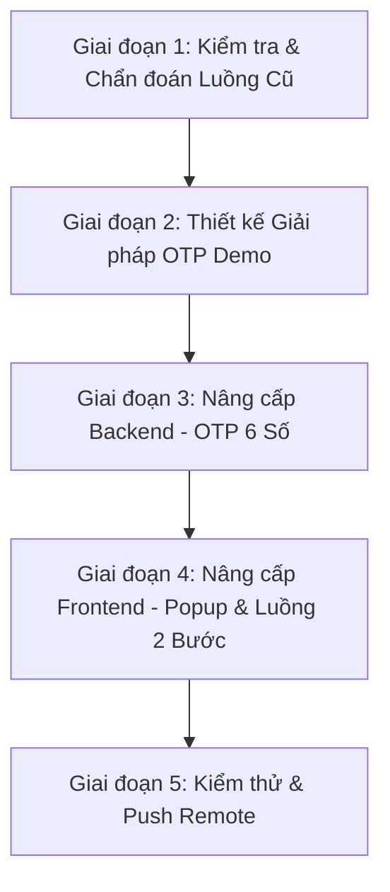

# BeautyPals - AI Development Log: Chức Năng Quên Mật Khẩu (Forgot Password)

> **Nhánh (Branch):** `quen-mat-khau`
> **Dự án:** BeautyPals - Nền tảng Quản trị Chuỗi Mỹ phẩm & Thương mại (IS207 - Web App)
> **Kiến trúc:** Node.js (Express) + MySQL / In-Memory Store + React (Vite + Tailwind CSS) + OTP Demo Mode
> **Ngày thực hiện:** 27/09/2026

---

## Mục Lục
1. [Tổng quan mục tiêu](#1-tổng-quan-mục-tiêu)
2. [Phân tích Trạng thái Ban đầu & Vấn đề](#2-phân-tích-trạng-thái-ban-đầu--vấn-đề)
3. [Timeline & Các giai đoạn phát triển](#3-timeline--các-giai-đoạn-phát-triển)
   - [Giai đoạn 1: Kiểm tra & Chẩn đoán Luồng Cũ](#giai-đoạn-1-kiểm-tra--chẩn-đoán-luồng-cũ)
   - [Giai đoạn 2: Thiết kế Giải pháp Demo OTP Mode](#giai-đoạn-2-thiết-kế-giải-pháp-demo-otp-mode)
   - [Giai đoạn 3: Nâng cấp Backend - OTP 6 Chữ Số](#giai-đoạn-3-nâng-cấp-backend---otp-6-chữ-số)
   - [Giai đoạn 4: Nâng cấp Frontend - Browser Native Popup & Luồng 2 Bước](#giai-đoạn-4-nâng-cấp-frontend---browser-native-popup--luồng-2-bước)
   - [Giai đoạn 5: Kiểm thử & Push lên Remote](#giai-đoạn-5-kiểm-thử--push-lên-remote)
4. [Chi tiết Kiến trúc Hệ thống & Files Mã nguồn](#4-chi-tiết-kiến-trúc-hệ-thống--files-mã-nguồn)
5. [Tóm tắt API Endpoints](#5-tóm-tắt-api-endpoints)
6. [Hướng dẫn Chạy Local & Tài khoản Demo](#6-hướng-dẫn-chạy-local--tài-khoản-demo)
7. [Tổng kết & Trạng thái hiện tại](#7-tổng-kết--trạng-thái-hiện-tại)

---

## 1. Tổng quan mục tiêu

Mục tiêu của nhánh `quen-mat-khau` là **hoàn thiện và khắc phục chức năng Quên Mật Khẩu** vốn bị kẹt ở bước nhập email trong phiên bản trước, đồng thời thiết kế lại luồng người dùng sao cho hoạt động mượt mà trong **môi trường demo không cần gửi email thật**:

- **Chuyển đổi cơ chế sinh mã**: Từ chuỗi token ngẫu nhiên 64 ký tự (`crypto.randomBytes(32).toString('hex')`) sang **mã OTP gồm 6 chữ số ngẫu nhiên** trực quan, thân thiện với người dùng.
- **Thông báo OTP qua Browser Native Popup**: Thay vì hiển thị token trực tiếp trong giao diện web, mã OTP sẽ bật lên dưới dạng **hộp thông báo pop-up của trình duyệt** (`window.alert()`).
- **Luồng người dùng liền mạch**: Sau khi nhấn OK trên pop-up, hệ thống tự động điều hướng sang màn hình Đặt Lại Mật Khẩu có sẵn email đã nhập.
- **Xử lý lỗi rõ ràng**: Nếu email không tồn tại trong hệ thống, trả về thông báo lỗi cụ thể thay vì im lặng.
- **Bổ sung tài khoản seed demo**: Thêm sẵn `admin@gmail.com` và `customer@gmail.com` để kiểm thử nhanh không cần đăng ký.

---

## 2. Phân tích Trạng thái Ban đầu & Vấn đề

### Vấn đề gốc (trước khi sửa)

Luồng quên mật khẩu tồn tại **2 vấn đề nghiêm trọng** khiến tính năng không thể hoàn thành:

#### ❌ Vấn đề 1: Bị kẹt khi email không tồn tại trong CSDL
- **Backend** trả về `{ resetToken: null, message: "Nếu email tồn tại..." }` (cố tình ẩn để tránh dò quét user).
- **Frontend** nhận `resetToken: null` và chuyển sang màn hình "Yêu cầu đã được gửi!".
- Vì `resetToken` là `null`, khung hiển thị token và nút điều hướng không xuất hiện.
- **Kết quả**: Người dùng bị kẹt hoàn toàn — màn hình thành công hiện ra nhưng không có hành động nào tiếp theo.

#### ❌ Vấn đề 2: Token dài 64 ký tự không thân thiện
- Khi email **có** trong CSDL, backend tạo chuỗi hex 64 ký tự (`77781551f6fc00a7c31...`) trả về.
- Frontend hiển thị chuỗi này **ngay trên giao diện web** trong một khung màu hồng.
- Chuỗi quá dài, không thể ghi nhớ, trải nghiệm demo kém chuyên nghiệp.

---

## 3. Timeline & Các giai đoạn phát triển



### Giai đoạn 1: Kiểm tra & Chẩn đoán Luồng Cũ

Tiến hành kiểm tra toàn bộ mã nguồn để xác định đúng vị trí và nguyên nhân bị kẹt:

- **Backend** (`authService.js`): Phát hiện hàm `requestPasswordReset` trả về `{ resetToken: null }` thay vì ném lỗi khi email không tồn tại.
- **Backend** (`authController.js`): Xác nhận response trả ra thiếu field `otp` — frontend không có cách đọc giá trị OTP riêng biệt.
- **Frontend** (`ForgotPasswordPage.jsx`): Phát hiện component chỉ render nút điều hướng khi `successInfo.resetToken` khác `null`. Khi `null`, người dùng không có cách nào tiến tiếp.
- **Kiến trúc tổng thể**: Xác nhận không có `emailService` hay thư viện gửi mail nào (`nodemailer`, `resend`, v.v.) được tích hợp — phù hợp với yêu cầu không dùng email thật.

---

### Giai đoạn 2: Thiết kế Giải pháp Demo OTP Mode

Sau khi phân tích, lựa chọn **Phương án Demo OTP thuần túy** với các nguyên tắc thiết kế:

1. **Mã 6 chữ số**: Dễ ghi nhớ, tương tự mã OTP ngân hàng/ứng dụng thực tế, thân thiện khi demo.
2. **Browser Native Popup**: Dùng `window.alert()` để bật thông báo trực tiếp trên trình duyệt — không thay đổi giao diện web, trực quan và dễ nhận biết.
3. **Luồng tự động**: Sau khi người dùng bấm OK trên popup, hệ thống tự điều hướng sang `/reset-password?email=...`.
4. **Thông báo lỗi rõ ràng**: Nếu email chưa đăng ký, hiện ngay thông báo lỗi để người dùng biết cần kiểm tra lại.
5. **Gợi ý tài khoản**: Hiển thị danh sách email mẫu để tester có thể click điền nhanh.

---

### Giai đoạn 3: Nâng cấp Backend - OTP 6 Chữ Số

**File thay đổi:** `backend/src/services/authService.js` và `backend/src/controllers/authController.js` và `backend/src/data/db.js`

#### Thay đổi trong `authService.js`:

| Điểm thay đổi | Trước | Sau |
|---|---|---|
| Khi email không tồn tại | Trả về `{ resetToken: null }` (không ném lỗi) | Ném lỗi 404 với thông báo rõ ràng |
| Cơ chế sinh mã | `crypto.randomBytes(32).toString('hex')` (64 ký tự) | `Math.floor(100000 + Math.random() * 900000).toString()` (6 chữ số) |
| Thời hạn mã | 60 phút | 15 phút |
| Tên trường trả về | `resetToken` | `resetToken` + `otp` (đồng thời) |
| Log console | Không có | In mã OTP ra terminal để debug |

#### Thay đổi trong `authController.js`:

```js
// Thêm field otp vào data response để frontend đọc riêng
data: {
  resetToken: result.resetToken,
  otp: result.resetToken,   // ← Thêm mới
  email: result.email,
}
```

#### Thay đổi trong `db.js` (In-Memory Store):

Bổ sung thêm 2 tài khoản seed cho môi trường demo:

```js
// Tài khoản mới được seed sẵn
{ email: 'admin@gmail.com',    password: 'Admin@123',    role: 'admin' }
{ email: 'customer@gmail.com', password: 'Customer@123', role: 'customer' }
```

---

### Giai đoạn 4: Nâng cấp Frontend - Browser Native Popup & Luồng 2 Bước

**Files thay đổi:** `frontend/src/modules/auth/ForgotPasswordPage.jsx` và `ResetPasswordPage.jsx`

#### `ForgotPasswordPage.jsx` — Giao diện Quên Mật Khẩu

**Cấu trúc luồng mới:**

```
Người dùng nhập email
    ↓ Bấm "Tạo Mã Xác Thực Đặt Lại"
    ↓ API gọi POST /api/auth/forgot-password
    ↓ Nhận OTP 6 số trong response
    ↓ window.alert("🔔 Mã OTP của bạn là: XXXXXX ...") ← POP-UP TRÌNH DUYỆT
    ↓ Người dùng bấm OK
    ↓ navigate('/reset-password?email=...') ← TỰ ĐỘNG CHUYỂN TRANG
```

**Các cải tiến UI:**
- Loại bỏ hoàn toàn màn hình "Yêu cầu đã được gửi" (nguyên nhân gây kẹt).
- Giữ nguyên form nhập email trên giao diện web, OTP chỉ bật qua browser popup.
- Thêm ô gợi ý nhanh 3 email tài khoản demo có sẵn (click để điền tự động).
- Thông báo lỗi hiện ngay nếu email chưa đăng ký trong hệ thống.

#### `ResetPasswordPage.jsx` — Giao diện Đặt Lại Mật Khẩu

**Các cải tiến:**
- Tự động nhận email từ URL params (`?email=...`) — hiển thị rõ đang đặt lại cho tài khoản nào.
- Ô nhập mã OTP chỉ nhận tối đa 6 ký tự, placeholder hướng dẫn cụ thể.
- Nút **"Gửi lại mã OTP"** với đồng hồ đếm ngược 60 giây (chống spam) — khi gửi lại, OTP mới cũng bật qua browser popup.
- Xác nhận mật khẩu (Confirm Password) trước khi submit.
- Màn hình thành công chuyển ngay về trang đăng nhập.

---

### Giai đoạn 5: Kiểm thử & Push lên Remote

#### Kết quả kiểm thử tự động (`npm run test:auth`):

```
🧪 [TEST RUNNER] Test Server started on port 5055
  ✅ [PASS] Health Check API returns status 200
  ✅ [PASS] POST /api/auth/register creates a new user
  ✅ [PASS] POST /api/auth/register fails on duplicate email
  ✅ [PASS] POST /api/auth/login succeeds with valid credentials
  ✅ [PASS] POST /api/auth/login rejects invalid password
  ✅ [PASS] GET /api/auth/me returns profile for authenticated user
  ✅ [PASS] POST /api/auth/forgot-password issues reset token (OTP: 358528)
  ✅ [PASS] POST /api/auth/reset-password changes user password
  ✅ [PASS] POST /api/auth/login works with newly updated password

  📊 TEST RESULTS: 9 PASSED, 0 FAILED
```

#### Lệnh Git Push:

```powershell
# 1. Xem danh sách files đã thay đổi
git status

# 2. Thêm toàn bộ file vào staging
git add backend/src/controllers/authController.js \
        backend/src/data/db.js \
        backend/src/services/authService.js \
        frontend/src/modules/auth/ForgotPasswordPage.jsx \
        frontend/src/modules/auth/ResetPasswordPage.jsx

# 3. Tạo commit
git commit -m "feat(auth): cap nhat ma OTP 6 so ngau nhien va pop-up thong bao quen mat khau"

# 4. Push lên remote
git push origin quen-mat-khau
```

> ✅ **Kết quả:** `f78727d..c430287  quen-mat-khau -> quen-mat-khau`

---

## 4. Chi tiết Kiến trúc Hệ thống & Files Mã nguồn

```
IS207.R11/
├── backend/
│   ├── src/
│   │   ├── controllers/
│   │   │   └── authController.js     # ✏️ Thêm field otp vào response forgot-password
│   │   ├── data/
│   │   │   └── db.js                 # ✏️ Bổ sung seed demo users (admin/customer @gmail.com)
│   │   ├── models/
│   │   │   └── userModel.js          # (Không đổi) findByResetToken, setResetToken, updatePassword
│   │   ├── routes/
│   │   │   └── authRoutes.js         # (Không đổi) POST /forgot-password, /reset-password
│   │   ├── services/
│   │   │   └── authService.js        # ✏️ OTP 6 số, lỗi rõ ràng, token 15 phút
│   │   ├── app.js                    # (Không đổi) Express + CORS + Error Handler
│   │   └── server.js                 # (Không đổi) Entry point Port 5000
│   └── test/
│       └── authTest.js               # (Không đổi) 9 kịch bản kiểm thử tự động
│
├── frontend/
│   └── src/
│       └── modules/
│           └── auth/
│               ├── ForgotPasswordPage.jsx  # ✏️ Xoá màn hình token cũ, thêm popup + demo hints
│               └── ResetPasswordPage.jsx   # ✏️ OTP input 6 số, resend countdown, email context
│
└── docs/
    ├── AUTH_CHANGELOG.md                   # (Có sẵn) Changelog nhánh log-in
    └── FORGOT_PASSWORD_CHANGELOG.md        # ✅ Tài liệu này (nhánh quen-mat-khau)
```

---

## 5. Tóm tắt API Endpoints

| Method | Endpoint | Quyền hạn | Mô tả | Payload |
|---|---|---|---|---|
| `POST` | `/api/auth/forgot-password` | Public | Sinh mã OTP 6 số cho email đã đăng ký | `{ email }` |
| `POST` | `/api/auth/reset-password` | Public | Xác thực OTP & cập nhật mật khẩu mới | `{ token, newPassword }` |
| `POST` | `/api/auth/login` | Public | Đăng nhập với mật khẩu mới sau khi reset | `{ account, password }` |

### Cơ chế Demo OTP

| Đặc điểm | Chi tiết |
|---|---|
| **Độ dài mã OTP** | 6 chữ số ngẫu nhiên (`100000 – 999999`) |
| **Thời hạn hiệu lực** | 15 phút kể từ thời điểm tạo |
| **Cách thông báo** | Browser native `window.alert()` popup |
| **Sau khi dùng** | Token bị xoá khỏi CSDL sau khi đổi mật khẩu thành công |
| **Log terminal** | In mã OTP ra console backend để dễ debug |

---

## 6. Hướng dẫn Chạy Local & Tài khoản Demo

### Khởi động dự án

**Terminal 1 — Backend:**
```powershell
cd backend
node --watch src/server.js
# ✅ Server running on http://localhost:5000
```

**Terminal 2 — Frontend:**
```powershell
cd frontend
npx vite
# ✅ Local: http://localhost:3000/
```

### Tài khoản Demo Sẵn Có

| Email | Mật khẩu | Vai trò |
|---|---|---|
| `admin@gmail.com` | `Admin@123` | Quản trị viên |
| `admin@beautypals.com` | `Admin@123` | Quản trị viên |
| `customer@gmail.com` | `Customer@123` | Khách hàng |
| `customer@beautypals.com` | `Customer@123` | Khách hàng |

### Trải nghiệm tính năng Quên Mật Khẩu

1. Truy cập [http://localhost:3000/forgot-password](http://localhost:3000/forgot-password)
2. Nhấp chọn email mẫu từ ô gợi ý **(hoặc gõ thủ công)**
3. Bấm nút **"Tạo Mã Xác Thực Đặt Lại"**
4. **Trình duyệt bật pop-up** hiển thị mã OTP 6 chữ số
5. Ghi nhớ mã → Bấm **OK** → Hệ thống tự chuyển sang trang Đặt Lại Mật Khẩu
6. Nhập mã OTP + mật khẩu mới → Bấm **"Lưu Mật Khẩu Mới"**
7. Đăng nhập bằng mật khẩu mới ✅

---

## 7. Tổng kết & Trạng thái hiện tại

- ✅ **Lỗi kẹt luồng** đã được khắc phục hoàn toàn — người dùng luôn có hành động tiếp theo.
- ✅ **Không còn hiển thị token dài** trong giao diện web — mã OTP 6 số bật qua popup trình duyệt.
- ✅ **Luồng 2 bước hoàn chỉnh**: Nhập email → Popup OTP → Điền OTP + mật khẩu mới → Đăng nhập.
- ✅ **Kiểm thử tự động 9/9 pass** — toàn bộ luồng xác thực hoạt động đúng.
- ✅ **Không cần cấu hình email thật** — hoàn toàn phù hợp cho môi trường demo & đồ án.
- ✅ **Code đã được push** lên nhánh `quen-mat-khau` tại commit `c430287`.
